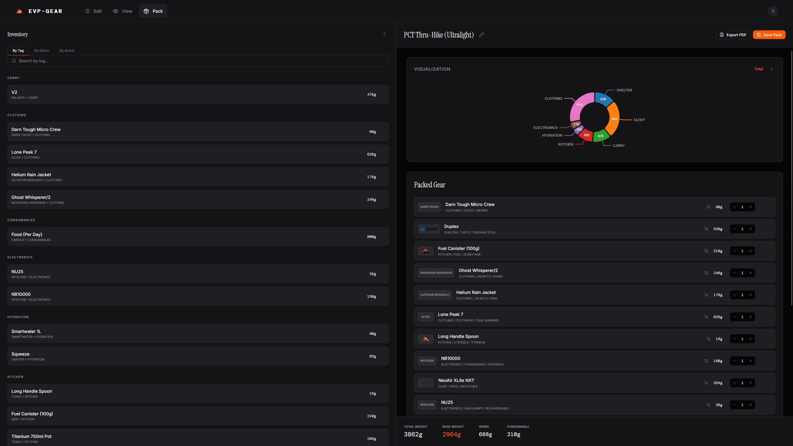
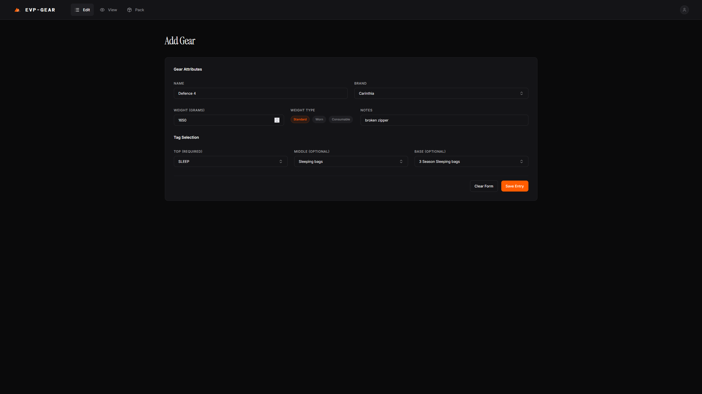
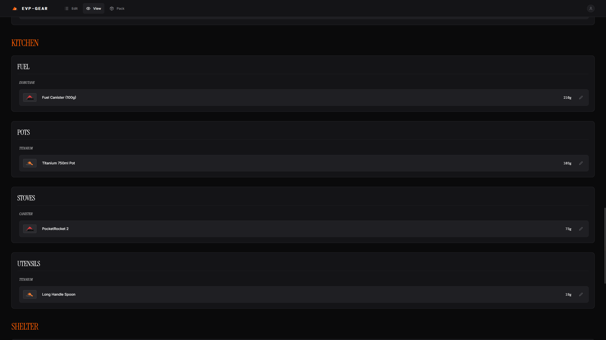
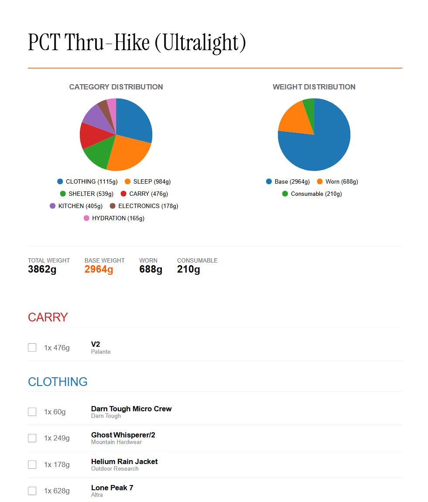

<div align="center">
  
  <h1>[EVP-Gear].(https://lleonhardwatzl.uk/).</h1>
  <p><strong>A modular, local-first web application designed for precise gear management and pack planning.</strong></p>

  
  
  
  
</div>

<br />

EVP-Gear is an analytical, database-driven tool for backpackers, climbers, and photographers to obsessively track and analyze their equipment. Built for speed and privacy, it runs entirely in your browser using IndexedDB.

## 📸 The Interface

<table>
  <tr>
    <td>
      <strong>The Builder (Pack Page)</strong><br />
      <em>Assemble loadouts and analyze weight distribution via interactive Nivo pie charts.</em><br />
      
    </td>
    <td>
      <strong>The Input Engine (Edit Page)</strong><br />
      <em>Rapidly add gear using the dynamic 3-tier tagging system and Zod-validated forms.</em><br />
      
    </td>
  </tr>
  <tr>
    <td>
      <strong>The Database (View Page)</strong><br />
      <em>Search and filter your entire local gear inventory instantly.</em><br />
      
    </td>
    <td>
      <strong>PDF Export</strong><br />
      <em>Generate beautiful, checklist-style PDF reports of your assembled packs.</em><br />
      
    </td>
  </tr>
</table>

## ✨ Key Features

*   **Strict 3-Tier Hierarchy:** Organize gear by `Top-Tag` (e.g., Sleep), `Middle-Tag` (e.g., Sleeping Bags), and `Base-Tag` (e.g., 3-Season).
*   **Local-First Architecture:** Powered by Dexie.js (IndexedDB). Your data never leaves your browser. Fast, private, and works completely offline.
*   **Advanced Analytics:** Differentiates between `Standard`, `Worn`, and `Consumable` weights to give you accurate Base Weight calculations.
*   **Adaptive Theming:** Seamlessly switch between Dark, Light, and Nature themes (including dynamic browser favicons).
*   **Mobile Optimized:** The entire UI, including complex split-screen builders, is fully responsive for use on the trail.

## 🛠️ Tech Stack

*   **Core:** React 19, TypeScript, Vite
*   **Styling:** Tailwind CSS v4, Shadcn UI
*   **State & Data:** Zustand (global state), Dexie.js (IndexedDB wrapper)
*   **Forms & Validation:** React Hook Form, Zod
*   **Visualization:** Nivo Charts, React-PDF

## 🚀 Getting Started

To run EVP-Gear locally:

1.  Clone the repository:
    ```bash
    git clone https://github.com/AlpineOpponent/EVP-Gear.git
    ```
2.  Navigate to the directory:
    ```bash
    cd EVP-Gear
    ```
3.  Install dependencies:
    ```bash
    npm install
    ```
4.  Start the development server:
    ```bash
    npm run dev
    ```

## 🤝 Contributors

*   **[AlpineOpponent](https://github.com/AlpineOpponent)** - Creator & Lead Developer
*   **Gemini** - AI Development Assistant

<br />
<div align="center">
  <i>"Measure twice, pack once."</i>
</div>
